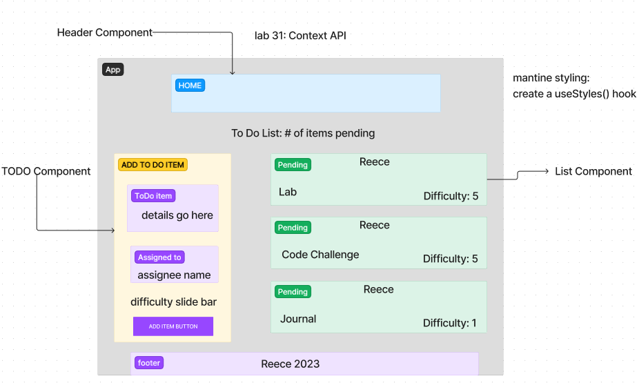
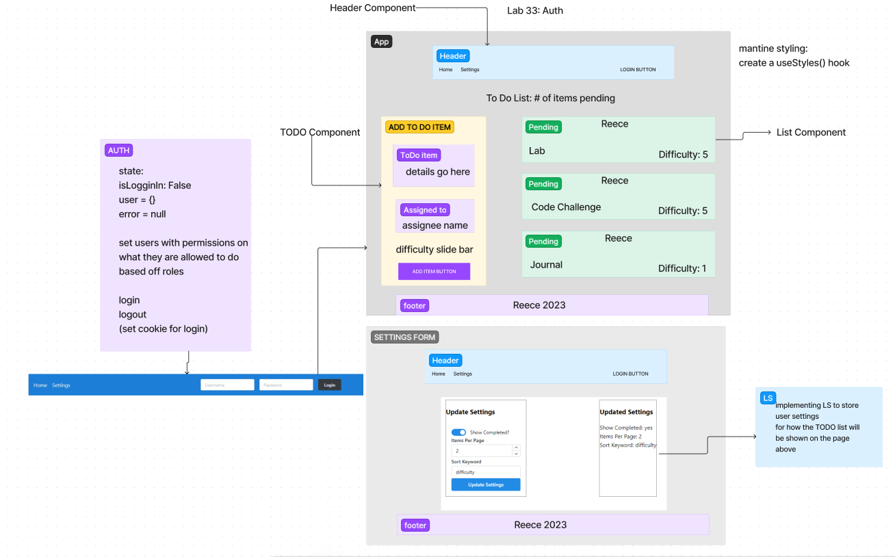
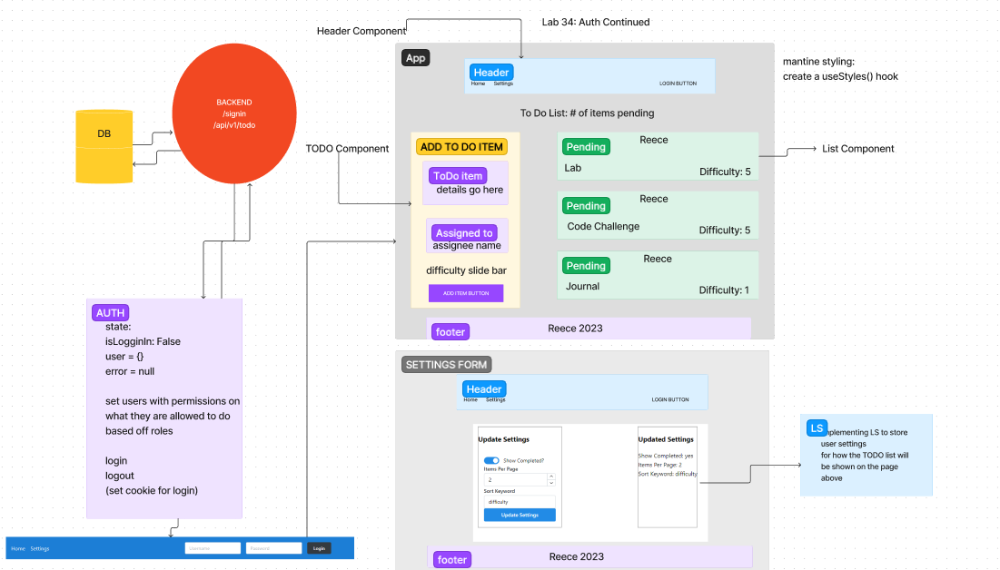

# LAB - Class 31

## Project: Context API

### Author: Reece Renninger

### Problem Domain  

In Phase 1, we’re going to perform some refactoring of a Todo application built by another team. This application mixes application state and user settings at the top level and passes things around. It was a good proof of concept, but we need to make this production ready.

    Create a Detailed UML.
    Properly modularize the application into separate components, note the proposed file structure below.
    Implement the Context API to make some basic application settings available to components.
        Show three items by default.
        Hide completed items by default.
        Add the sort word ‘difficulty’ by default.
    Style the application using the Mantine Component API{target:_blank}.
        NOTE: The expectation to style this entire component in one day is likely unrealistic. The recommendation is to implement the required functionality, then systematically begin styling with Mantine. Match the comp image(s) as closely as possible. 80% of the design work will likely take 20% of your time. By the end of the week, being mostly there with style is the goal!

### Links and Resources

- [GitHub Actions ci/cd](https://github.com/ReeceRenninger/todo-app/actions)
- [front-end application](https://codesandbox.io/p/github/ReeceRenninger/todo-app/context-settings?layout=%257B%2522sidebarPanel%2522%253A%2522EXPLORER%2522%252C%2522rootPanelGroup%2522%253A%257B%2522direction%2522%253A%2522horizontal%2522%252C%2522type%2522%253A%2522PANEL_GROUP%2522%252C%2522id%2522%253A%2522ROOT_LAYOUT%2522%252C%2522panels%2522%253A%255B%257B%2522type%2522%253A%2522PANEL_GROUP%2522%252C%2522direction%2522%253A%2522horizontal%2522%252C%2522id%2522%253A%2522EDITOR%2522%252C%2522panels%2522%253A%255B%257B%2522type%2522%253A%2522PANEL%2522%252C%2522panelType%2522%253A%2522TABS%2522%252C%2522id%2522%253A%2522cljf0enkt00952a6fdbwh7deq%2522%257D%255D%252C%2522sizes%2522%253A%255B100%255D%257D%252C%257B%2522type%2522%253A%2522PANEL_GROUP%2522%252C%2522direction%2522%253A%2522horizontal%2522%252C%2522id%2522%253A%2522DEVTOOLS%2522%252C%2522panels%2522%253A%255B%257B%2522type%2522%253A%2522PANEL%2522%252C%2522panelType%2522%253A%2522TABS%2522%252C%2522id%2522%253A%2522cljf0enkt00972a6f3fxlu98n%2522%257D%255D%252C%2522sizes%2522%253A%255B100%255D%257D%255D%252C%2522sizes%2522%253A%255B50%252C50%255D%257D%252C%2522tabbedPanels%2522%253A%257B%2522cljf0enkt00952a6fdbwh7deq%2522%253A%257B%2522tabs%2522%253A%255B%257B%2522id%2522%253A%2522cljf0enkt00942a6fp6g1ir9r%2522%252C%2522mode%2522%253A%2522permanent%2522%252C%2522type%2522%253A%2522FILE%2522%252C%2522filepath%2522%253A%2522%252FREADME.md%2522%257D%255D%252C%2522id%2522%253A%2522cljf0enkt00952a6fdbwh7deq%2522%252C%2522activeTabId%2522%253A%2522cljf0enkt00942a6fp6g1ir9r%2522%257D%252C%2522cljf0enkt00972a6f3fxlu98n%2522%253A%257B%2522tabs%2522%253A%255B%257B%2522id%2522%253A%2522cljf0enkt00962a6fw6jf8ebg%2522%252C%2522mode%2522%253A%2522permanent%2522%252C%2522type%2522%253A%2522PROJECT_SETUP%2522%257D%255D%252C%2522id%2522%253A%2522cljf0enkt00972a6f3fxlu98n%2522%252C%2522activeTabId%2522%253A%2522cljf0enkt00962a6fw6jf8ebg%2522%257D%257D%252C%2522showDevtools%2522%253Atrue%252C%2522showSidebar%2522%253Atrue%252C%2522sidebarPanelSize%2522%253A15%257D) (when applicable)

### Collaborators

### Setup

#### `.env` requirements (where applicable)

for now I have none and do not require one

#### How to initialize/run your application (where applicable)

- e.g. `npm start`

#### How to use your library (where applicable)

#### Features

- Global state is able to be consumed by the components due to setting the provider with the context over the APP at the root index level.  This allows for the context information we set up in the Todo to be passed down to all the components through App for consumption.
- The useForm() operation is used to handle the form submission and the change of the input fields.  This is done by passing in the initial state of the form and then returning the values and the handleInputChange function to be used in the form.

#### Tests

npm test

#### UML

\\\\\\\\\\\\\\\\\\\\\\\\\\\\\\\\\\\\\\\\\\\\\\\\\\\\\\\\\\\\\\\\\\\\\\\\\\\\\\\\\\\\\\\\\\\\\\\\\\\\\\\\\\\\\\\\\\\\\\\

# LAB - Class 32

## Project: Extending Todo List Functionality

### Author: Reece Renninger

### Problem Domain  

In Phase 2, we’re going to extend the functionality of our application by allowing the user to make some decisions on how they would like the application to function. Specifically, we’ll let them make changes to 2 settings.

    Implement the Context API to make some basic application settings available to components.
        How many To Do Items to show at once.
        Whether or not to show completed items.
        Hint: if reusing the custom useForm() hook, event validation may be necessary if using any Mantine component other than <TextInput />.
    Provide the users with a form where they can change the values for those settings.
        This should be given in the form of a new component, perhaps linked to from the main navigation.
        Hint: Use Browser Router to create the page/route/component for this.
        Once settings are updated, render the updated settings to the right of the “form”. Consider using <Grid />, <Card />, and <When /> components.
    Save the users choices in Local Storage.
    Retrieve their preferences from Local Storage and apply them to the application on startup.

### Links and Resources

- [GitHub Actions ci/cd](https://github.com/ReeceRenninger/todo-app/actions)
- [front-end application](https://codesandbox.io/p/github/ReeceRenninger/todo-app/context-methods?layout=%257B%2522sidebarPanel%2522%253A%2522EXPLORER%2522%252C%2522rootPanelGroup%2522%253A%257B%2522direction%2522%253A%2522horizontal%2522%252C%2522type%2522%253A%2522PANEL_GROUP%2522%252C%2522id%2522%253A%2522ROOT_LAYOUT%2522%252C%2522panels%2522%253A%255B%257B%2522type%2522%253A%2522PANEL_GROUP%2522%252C%2522direction%2522%253A%2522horizontal%2522%252C%2522id%2522%253A%2522EDITOR%2522%252C%2522panels%2522%253A%255B%257B%2522type%2522%253A%2522PANEL%2522%252C%2522panelType%2522%253A%2522TABS%2522%252C%2522id%2522%253A%2522cljgehn7h00ad2a6f60yzd25o%2522%257D%255D%252C%2522sizes%2522%253A%255B100%255D%257D%252C%257B%2522type%2522%253A%2522PANEL_GROUP%2522%252C%2522direction%2522%253A%2522horizontal%2522%252C%2522id%2522%253A%2522DEVTOOLS%2522%252C%2522panels%2522%253A%255B%257B%2522type%2522%253A%2522PANEL%2522%252C%2522panelType%2522%253A%2522TABS%2522%252C%2522id%2522%253A%2522cljgehn7h00af2a6fq35yxyw2%2522%257D%255D%252C%2522sizes%2522%253A%255B100%255D%257D%255D%252C%2522sizes%2522%253A%255B50%252C50%255D%257D%252C%2522tabbedPanels%2522%253A%257B%2522cljgehn7h00ad2a6f60yzd25o%2522%253A%257B%2522tabs%2522%253A%255B%257B%2522id%2522%253A%2522cljgehn7h00ac2a6fwao1rlv6%2522%252C%2522mode%2522%253A%2522permanent%2522%252C%2522type%2522%253A%2522FILE%2522%252C%2522filepath%2522%253A%2522%252FREADME.md%2522%257D%255D%252C%2522id%2522%253A%2522cljgehn7h00ad2a6f60yzd25o%2522%252C%2522activeTabId%2522%253A%2522cljgehn7h00ac2a6fwao1rlv6%2522%257D%252C%2522cljgehn7h00af2a6fq35yxyw2%2522%253A%257B%2522tabs%2522%253A%255B%257B%2522id%2522%253A%2522cljgehn7h00ae2a6flc72td79%2522%252C%2522mode%2522%253A%2522permanent%2522%252C%2522type%2522%253A%2522PROJECT_SETUP%2522%257D%255D%252C%2522id%2522%253A%2522cljgehn7h00af2a6fq35yxyw2%2522%252C%2522activeTabId%2522%253A%2522cljgehn7h00ae2a6flc72td79%2522%257D%257D%252C%2522showDevtools%2522%253Atrue%252C%2522showSidebar%2522%253Atrue%252C%2522sidebarPanelSize%2522%253A15%257D) (when applicable)

### Collaborators

### Setup

#### `.env` requirements (where applicable)

for now I have none and do not require one

#### How to initialize/run your application (where applicable)

- e.g. `npm start`

#### How to use your library (where applicable)

#### Features / Routes

- Feature One: Local user settings persist with local storage to allow todo list to be customized
- Feature Two: User can add, delete, and hide completed tasks
- Feature Three: User can sort tasks by difficulty

#### Tests

- npm test

#### UML

\\\\\\\\\\\\\\\\\\\\\\\\\\\\\\\\\\\\\\\\\\\\\\\\\\\\\\\\\\\\\\\\\\\\\\\\\\\\\\\\\\\\\\\\\\\\\\\\\\\\\\\\\\\\\\\\\\\\\\\

# LAB - Class 33

## Project: Auth

### Author: Reece Renninger

### Problem Domain  

In Phase 3, we’d like to extend the functionality of the application by requiring users be logged in to view items and also restrict access based on user type. The user stories from Phases 1, and 2 remain unchanged. For this phase, we are now adding the following new user stories.

    As a user, I want to provide a way for other users to create new accounts.
    As a user, I want to provide a way for all users to login to their account.
    As a user, I want to make sure that my To Do items are only viewable to users that have logged in with a valid account.
    As a user, I want to ensure that only fellow users that are allowed to “create”, based on their user type, can add new To Do Items.
    As a user, I want to ensure that only fellow users that are allowed to “update”, based on their user type, can mark To Do Items complete.
    As a user, I want to ensure that only fellow users that are allowed to “delete”, based on their user type, can delete new To Do Items.

### Links and Resources

- [GitHub Actions ci/cd](https://github.com/ReeceRenninger/todo-app/actions) 
- [front-end application](https://codesandbox.io/p/github/ReeceRenninger/todo-app/auth?layout=%257B%2522sidebarPanel%2522%253A%2522EXPLORER%2522%252C%2522rootPanelGroup%2522%253A%257B%2522direction%2522%253A%2522horizontal%2522%252C%2522type%2522%253A%2522PANEL_GROUP%2522%252C%2522id%2522%253A%2522ROOT_LAYOUT%2522%252C%2522panels%2522%253A%255B%257B%2522type%2522%253A%2522PANEL_GROUP%2522%252C%2522direction%2522%253A%2522horizontal%2522%252C%2522id%2522%253A%2522EDITOR%2522%252C%2522panels%2522%253A%255B%257B%2522type%2522%253A%2522PANEL%2522%252C%2522panelType%2522%253A%2522TABS%2522%252C%2522id%2522%253A%2522cljhrj9dx00cm2a6ftq2yl6tt%2522%257D%255D%252C%2522sizes%2522%253A%255B100%255D%257D%252C%257B%2522type%2522%253A%2522PANEL_GROUP%2522%252C%2522direction%2522%253A%2522horizontal%2522%252C%2522id%2522%253A%2522DEVTOOLS%2522%252C%2522panels%2522%253A%255B%257B%2522type%2522%253A%2522PANEL%2522%252C%2522panelType%2522%253A%2522TABS%2522%252C%2522id%2522%253A%2522cljhrj9dx00co2a6f6f35sk0o%2522%257D%255D%252C%2522sizes%2522%253A%255B100%255D%257D%255D%252C%2522sizes%2522%253A%255B50%252C50%255D%257D%252C%2522tabbedPanels%2522%253A%257B%2522cljhrj9dx00cm2a6ftq2yl6tt%2522%253A%257B%2522tabs%2522%253A%255B%257B%2522id%2522%253A%2522cljhrj9dx00cl2a6fja59qf91%2522%252C%2522mode%2522%253A%2522permanent%2522%252C%2522type%2522%253A%2522FILE%2522%252C%2522filepath%2522%253A%2522%252FREADME.md%2522%257D%255D%252C%2522id%2522%253A%2522cljhrj9dx00cm2a6ftq2yl6tt%2522%252C%2522activeTabId%2522%253A%2522cljhrj9dx00cl2a6fja59qf91%2522%257D%252C%2522cljhrj9dx00co2a6f6f35sk0o%2522%253A%257B%2522id%2522%253A%2522cljhrj9dx00co2a6f6f35sk0o%2522%252C%2522activeTabId%2522%253A%2522cljhrjtvz00tc2a6fh1cyvm4h%2522%252C%2522tabs%2522%253A%255B%257B%2522type%2522%253A%2522TASK_LOG%2522%252C%2522taskId%2522%253A%2522start%2522%252C%2522id%2522%253A%2522cljhrjtvz00tc2a6fh1cyvm4h%2522%252C%2522mode%2522%253A%2522permanent%2522%257D%252C%257B%2522type%2522%253A%2522TASK_PORT%2522%252C%2522taskId%2522%253A%2522start%2522%252C%2522port%2522%253A3000%252C%2522id%2522%253A%2522cljhrk2py011r2a6fgjya4iw9%2522%252C%2522mode%2522%253A%2522permanent%2522%252C%2522path%2522%253A%2522%2522%257D%255D%257D%257D%252C%2522showDevtools%2522%253Atrue%252C%2522showSidebar%2522%253Atrue%252C%2522sidebarPanelSize%2522%253A15%257D) (when applicable)

### Collaborators

### Setup

#### `.env` requirements (where applicable)

for now I have none and do not require one

#### How to initialize/run your application (where applicable)

- e.g. `npm start`

#### How to use your library (where applicable)

#### Features / Routes

- Feature One: Local user settings persist with local storage to allow todo list to be customized
- Feature Two: User can add, delete, and hide completed tasks
- Feature Three: User can sort tasks by difficulty
- Feature Four: Auth implemented with users able to sign in with different roles

#### Tests

- npm test

#### UML

\\\\\\\\\\\\\\\\\\\\\\\\\\\\\\\\\\\\\\\\\\\\\\\\\\\\\\\\\\\\\\\\\\\\\\\\\\\\\\\\\\\\\\\\\\\\\\\\\\\\\\\\\\\\\\\\\\\\\\\

# LAB - Class 34

## Project: Auth Continued

### Author: Reece Renninger

### Problem Domain  

In Phase 4, we will finalize the functionality of the application by connecting to live servers for login, authorization, and data access.

### Links and Resources

- [GitHub Actions ci/cd](https://github.com/ReeceRenninger/todo-app/actions)
- [front-end application](http://xyz.com) (when applicable)

### Collaborators

### Setup

#### `.env` requirements (where applicable)

for now I have none and do not require one

#### How to initialize/run your application (where applicable)

- e.g. `npm start`

#### How to use your library (where applicable)

#### Features / Routes

- Feature One: Local user settings persist with local storage to allow todo list to be customized
- Feature Two: User can add, delete, and hide completed tasks
- Feature Three: User can sort tasks by difficulty
- Feature Four: Auth implemented with users able to sign in with different roles
- Feature Five: Ping User API for login

#### Tests

- npm test

#### UML

